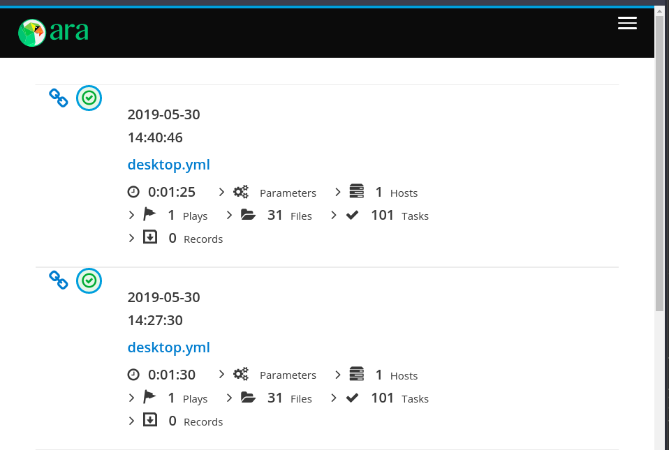

# About

Provisioning for my working station using Ansible.

## Know limitations

* kernel 5.8 + systemd 245 causes issues with checking services states,
  so ensure not to use kernel hwe-edge on focal.fossa - see
  [this](https://github.com/ansible/ansible/issues/71528#issuecomment-687620030)
* some stuff works better as sudo, such as
  `sudo ansible-playbook -v -i inventory.yml desktop.yml`

## Requirements

To run locally:

* [vagrant](https://www.vagrantup.com/)
* linux host with qemu-kvm to spawn virtual machine (virtualbox/windows not tested)
* working [vagrant-libvirt](https://github.com/vagrant-libvirt/vagrant-libvirt)

Above can be invoked under Ubuntu 20.04 via:

```bash
sudo apt install -y qemu-kvm libvirt vagrant vagrant-libvirt
```

* access to internet to download dependencies
* run `vagrant up`
* full run should take about 20 minutes (installing desktop on server)
* run from host `scripts/test_in_vagrant.sh` to fetch also `ara` reports
* after run you can exec `scripts/ara.sh` to see ansible runs results via
  web if you have ara installed on host
* re-run `scripts/test_in_vagrant.sh` and hit refresh in ara web

## Demo

[](https://asciinema.org/a/249319)

[](https://asciinema.org/a/249326)

After starting ara script you are presented with url to [localhost:8000](http://localhost:8000)
which shows ara web server, example image below.



## TODO

* set timezone to Etc/UTC
* rename roles so that they conform with ansible-linter etc
* ci: linters output to html
* guest: in-shell apt settings (retries)
* guest: ansible task retries for package installs
* guest: dnsmasq
* guest: smartgit
* guest: system reboot if required?

* sudo apt  install awscli

```bash
curl -o aws-iam-authenticator https://amazon-eks.s3.us-west-2.amazonaws.com/1.18.9/2020-11-02/bin/linux/amd64/aws-iam-authenticator
```

* containers/snaps/tools:

  + authy
  + backintime + config
  + dive
  + gimp
  + kaniko
  + kind
  + p7zip-desktop
  + skopeo
  + xnview

## Do not do

Notes to self:

* vagrant storage pools with primary disk are pain,
  this is vagrant-libvirt limitation
* jenkinsfile dynamic detection of nproc on jenkins worker,
  you will meet CPS/NonCPS chicken-egg errors

## Tips

* get local facts `ansible  -m setup  -i inventory.yml localhost`
