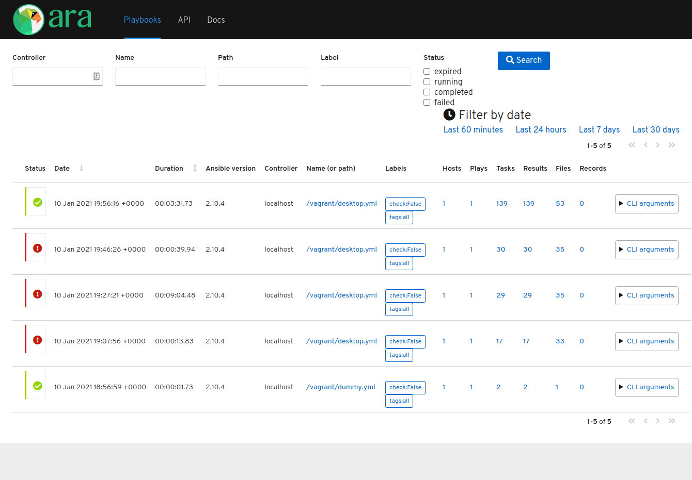

# About

Provisioning for my working station using Ansible.

## Requirements

To run locally:

* [vagrant](https://www.vagrantup.com/)
* linux host with quemu-kvm to spawn virutal machine (virtualbox/windows not tested)
* working [vagrant-libvirt](https://github.com/vagrant-libvirt/vagrant-libvirt)
* access to internet to download dependencies
* run `vagrant up`
* full run should take about 20 minutes (installing desktop on server)
* run from host `scripts/test_in_vagrant.sh` to fetch also ara reports
* after run you can exec `scripts/ara.sh` to see ansible runs results via web
* re-run `scripts/test_in_vagrant.sh` and hit refresh in ara web

## Demo

After starting ara script you are presented with url to [localhost:9191](http://localhost:9191)
which shows ara web server, example image below.

## TODO

* ci: linters output to html
* guest: in-shell apt settings (retries)
* guest: ansible task retries for package installs
* guest: dnsmasq
* guest: smartgit
* guest: apt dist-upgrade ( this is slow, just update box?)
* guest: system reboot if required?

## Do not do

Notes to self:

* vagrant storage pools with primary disk are pain,
  this is vagrant-libvirt limitation
* jenkinsfile dynamic detection of nproc on jenkins worker,
  you will meet CPS/NonCPS chicken-egg errors
